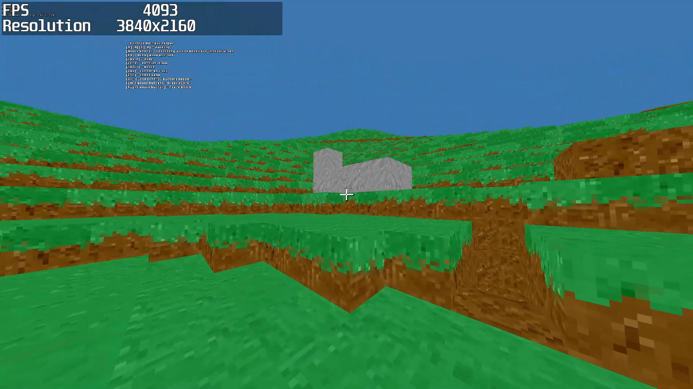

# Minecraft-GLFW

A small voxel engine written in C++17 and OpenGL 3.3 — procedural terrain,
block placing and breaking, AABB collision, and a batched chunk renderer.

<!-- Bare URL on its own line renders as a video player; do not wrap it in markdown. -->

https://github.com/user-attachments/assets/b456b98b-287f-4400-846f-f22d943abe3f



## History

The engine was written between **October and December 2020** as a college C++
coursework project, by two authors working in parallel — the commit split across
170 commits is close to even:

| Author | Commits |
| --- | ---: |
| [Navatusein](https://github.com/Navatusein) | 78 |
| [cnbcoldspot](https://github.com/cnbcoldspot) | 88 |
| others | 4 |

It was a Visual Studio–only project, with Win32 builds of GLEW, GLFW and SOIL
checked into the repository. In **2026** the build system was revived and the
code was ported to Linux. The engine itself is unchanged 2020 work; the port
touched the build files, replaced one dead dependency, and fixed the handful of
bugs that a modern toolchain turned from latent into fatal — see
[What the 2026 revival changed](#what-the-2026-revival-changed).

## What is implemented

**World and terrain**
- 32×32×32 voxel chunks, held in a `std::map` keyed by a packed 64-bit chunk
  coordinate (`Source/World/World.cpp`).
- Terrain from three octaves of OpenSimplex2S noise via
  [FastNoiseLite](https://github.com/Auburn/FastNoiseLite), summed at
  frequencies 0.3/1/3 with magnitudes 30/6/2 (`Source/World/ChunkGeneration.h`).
- Chunk generation runs off the main thread with `std::async`; one chunk is
  dispatched per frame, and `generated`/`updated`/`updating` flags keep the
  renderer from touching a chunk that is being built.
- The world is a fixed 12 × 2 × 12 grid of chunks — 288 in total, all created
  at startup. `H_DRAW_DISTANCE` and `V_DRAW_DISTANCE` are 6 and 1, but the
  loops run from `-N` to `N - 1`, so the grid spans −6…5 horizontally and −1…0
  vertically rather than a symmetric radius around the origin. `LoadChunk()`
  and `UnloadChunk()` are still stubs, so nothing streams: what exists at
  startup is the whole world.

**Rendering**
- `Mesh` / `BigMesh` / `ShardMesh` (`Source/Mesh/`): `BigMesh` owns one large
  pre-allocated vertex and index buffer per chunk, and `ShardMesh` pushes
  individual block faces into it — so a whole chunk is one draw call rather than
  one per block.
- Interior faces are skipped, including across chunk boundaries: each chunk
  holds a `Neighbor` struct of pointers to its six neighbours and consults them
  when meshing its edges (`Source/World/Chunk.cpp`).
- Thin RAII wrappers over the OpenGL objects — `VertexArray`, `VertexBuffer`,
  `IndexBuffer` (`Source/Vertex/`) — and a `Shader` class that compiles and
  links GLSL from `Resource/Shader/`.
- A 256×64 texture atlas of 16×16 tiles; blocks pick a texture variant so that
  identical block types do not tile visibly.

**Gameplay**
- Voxel ray cast (`World::RayCast`) for picking the block under the crosshair,
  out to 20 units.
- AABB collision and gravity against the voxel grid (`Source/Physics/AABB.h`,
  `Source/Player/Player.cpp`), with walking, sprinting, jumping, terminal
  velocity and ground drag. A no-gravity flight mode is implemented in the
  physics but has no key bound to it.
- GUI drawn from its own atlas and shader, with a crosshair that flashes when
  you break a block.
- F3 debug menu (held block ID, FPS, player position) and a controls overlay,
  both rendered with [glText](https://github.com/vallentin/glText).

The frame rate is uncapped, which is what the F3 counter is there to show — a
few thousand frames per second at the default draw distance. Call
`Window::SetVSync(true)` in `main.cpp` to lock it to the display refresh rate
instead, which is quieter and avoids tearing.

It starts windowed. The second argument to `Window::Initialize()` in `main.cpp`
switches it to fullscreen:

```cpp
Window::Initialize("Hello world", true);
```

Some modules are compiled but never wired into the game, and are marked as such
in their own headers: `Inventory` / `Item` / `ItemStack`, `Models/Model`, and
`VoxelDataBase` / `VoxelsID` with its `Resource/Blocks/*.block` format. They are
left in place as part of the original coursework.

## Controls

| Input | Action |
| --- | --- |
| `W` `A` `S` `D` | Walk |
| `Space` | Jump |
| `Left Shift` | Sprint |
| `Left Ctrl` | Slow down |
| Mouse | Look |
| Left mouse button | Break block |
| Right mouse button | Place block |
| Mouse wheel | Choose the block to place |
| `F3` | Toggle debug menu |
| `X` | Toggle the controls overlay |
| `Tab` | Release / capture the cursor |
| `Esc` | Quit |

## Building

The project builds with CMake on both platforms. GLM, FastNoiseLite and
stb_image are header-only and vendored in this repository, so they need no
installation.

### Linux

Install OpenGL, GLEW and GLFW 3.3+ from your package manager:

```sh
# Arch
sudo pacman -S base-devel cmake glew glfw

# Debian / Ubuntu
sudo apt install build-essential cmake libglew-dev libglfw3-dev libgl1-mesa-dev

# Fedora
sudo dnf install gcc-c++ cmake glew-devel glfw-devel mesa-libGL-devel
```

Then:

```sh
cmake -S . -B build -DCMAKE_BUILD_TYPE=Release
cmake --build build -j
./build/MinecraftGLFW
```

`Resource/` is copied next to the executable at build time, and the engine
anchors its working directory to the binary, so it can be launched from
anywhere.

### Windows

GLEW and GLFW are used from the prebuilt x64 libraries in `GLEW/` and `GLFW/`;
nothing needs to be installed.

With CMake (Visual Studio 2019 or newer):

```bat
cmake -S . -B build -A x64
cmake --build build --config Release
build\Release\MinecraftGLFW.exe
```

Or open `Minecraft GLFW.sln` in Visual Studio and build the **Release / x64**
configuration. The solution targets the v142 toolset; Visual Studio 2022 will
offer to retarget it, or you can install the VS2019 build tools alongside.

## Repository layout

```
Minecraft GLFW/Source/   Engine source
    World/               Chunks, voxels, terrain generation, ray casting
    Mesh/                Chunk mesh batching (Mesh, BigMesh, ShardMesh)
    Vertex/              VAO / VBO / IBO wrappers
    Graphic/             Shader and texture loading, GUI elements
    Player/              Movement, camera control, block interaction, HUD
    Physics/             AABB collision
    Window/              GLFW window and input
    FontRender/          glText (vendored)
Minecraft GLFW/Resource/ Shaders and textures
GLM/ Noise/ STB/         Header-only dependencies (vendored)
GLEW/ GLFW/              Prebuilt Windows libraries
```

## What the 2026 revival changed

The engine's behaviour is the same; these are the changes that were needed to
make it build and run again.

- **Build system.** Added a `CMakeLists.txt` covering both platforms. The
  Visual Studio solution still works and was updated to match.
- **SOIL → stb_image.** SOIL shipped as a Windows-only prebuilt `.lib` and is
  long unmaintained. `Source/Graphic/Texture.cpp` now uses
  [stb_image](https://github.com/nothings/stb) on both platforms.
- **Uninitialized physics state hung the game on launch.** `Entity` declared
  `Position`, `Velocity` and `m_acceleration` with no initializers, `glm::vec3`
  leaves its components uninitialized by default, and `Player`'s constructor
  never assigned the last two. The first physics step therefore read stack
  garbage — measured at around −8×10³³ — and `Position += Velocity * Delta` put
  the player at roughly 1e30 on frame one. `Player::CollisionTest()` then ran
  `for (float x = Position.x - 0.3f; x <= Position.x + 0.3f; x += 0.1f)`, and at
  that magnitude a float's ULP is about 1e23, so `x += 0.1f` could not change
  `x`: the loop never terminated, and each iteration inserted a garbage-keyed
  node into the chunk map. Whether it happened depended on what was on the
  stack, which is why it looked random — a blue screen and a freeze on roughly
  one launch in four. `Entity`'s members are now default-initialized.
- **Heap corruption in the text renderer.** `gltIsCharacterSupported()` in the
  vendored glText reports `'\t'` as supported, but `_gltUpdateBuffers()` handles
  only `'\n'` and `'\r'` — so a tab indexed the glyph table at `'\t' - ' '`, i.e.
  **−23**, and wrote past the end of the vertex buffer. The controls overlay
  began with a literal tab, so this corrupted the heap on every frame the
  overlay was visible. Fixed by range-checking the glyph index at both call
  sites, and by not starting that string with a tab.
- **Windows-only calls.** `Sleep()` and `<Windows.h>` in `Crosshair.cpp` became
  `std::this_thread::sleep_for`, and the `/STACK` pragma in `main.cpp` is now
  guarded by `_WIN32`. `__debugbreak` became a portable `DEBUGBREAK()` macro in
  `ErrorHandling.h` — note that the three uses in `Window.cpp` were written
  `__debugbreak;` without parentheses, so they did nothing and execution fell
  through into a null window handle. They now actually stop the process.
- **`clock()` busy-waits.** `Call_UpdateChunks()` and `Crosshair::Untrigger()`
  spun on `clock()`, which is wall-clock milliseconds on MSVC but *process CPU
  time* on glibc, with `CLOCKS_PER_SEC` a thousand times larger. Both are now
  `std::this_thread::sleep_for` — which is what they were imitating, without
  burning a core.
- **Case-sensitive paths.** `#include "chunk.h"` for a file named `Chunk.h`, and
  an include that only resolved through the Visual Studio working directory.
- **Resource lookup.** Shaders and textures were opened by paths relative to the
  working directory, so the game only ran from one specific folder. It now
  anchors its working directory to the executable. `CreateShaderProgram()` also
  set `exceptions(badbit)` on its streams, but a missing file sets *failbit* — so
  a shader that was not found was compiled as an empty string and reported as
  `syntax error, unexpected end of file`. It now names the file it could not
  read.
- **GLEW under Wayland.** GLFW hands out an EGL context, so GLEW's GLX probe
  returns `GLEW_ERROR_NO_GLX_DISPLAY` even though every entry point resolved.
  That one status is no longer treated as fatal.
- **Other uninitialized members.** `clang-tidy`'s
  `cppcoreguidelines-pro-type-member-init` found more of the same pattern. Three
  were reachable and are fixed: `~BigMesh()` `free()`s two pointers its default
  constructor left indeterminate, `Chunk::neighbor` is dereferenced after a null
  test but was never set to null, and the debug menu drew an indeterminate FPS
  value for the first second. The rest are in code paths that never execute.
- **Swap interval.** Nothing ever called `glfwSwapInterval()`, so the frame rate
  came from whatever the driver defaulted to — uncapped on Windows, but locked
  to the refresh rate by Mesa on Linux. `Window` now sets it explicitly and
  exposes `Window::SetVSync()`, so both platforms behave the same.
- **Viewport size.** The viewport, and the aspect ratio the GUI is built from,
  were taken from the monitor's *work area* rather than from the framebuffer.
  Those differ by the height of the window decoration — 77 pixels on the display
  this was tested on — so the bottom of the projection was clipped. Both now
  come from `glfwGetFramebufferSize()`, which is also what makes HiDPI correct.
  Fullscreen additionally sized itself from the work area, which excludes
  taskbars and panels; it now uses the monitor's video mode.
- **Warnings.** The build is warning-free. Fixed along the way: `ATLAS_W` /
  `ATLAS_H` defined with different values by two headers, `Voxel::GetID()`
  falling off the end of a non-`void` function, a missing `<cstring>`, and a
  stray semicolon after an `#include`.

Verified on Linux with a 60-second AddressSanitizer run reporting no errors,
and 45 consecutive launches with no hang.

## Third-party code

| Library | Use | License |
| --- | --- | --- |
| [GLFW](https://www.glfw.org/) | Window and input | Zlib |
| [GLEW](https://glew.sourceforge.net/) | OpenGL extension loading | BSD-3-Clause / MIT |
| [GLM](https://github.com/g-truc/glm) | Vector and matrix maths | MIT |
| [FastNoiseLite](https://github.com/Auburn/FastNoiseLite) | Terrain noise | MIT |
| [stb_image](https://github.com/nothings/stb) | PNG loading | MIT / public domain |
| [glText](https://github.com/vallentin/glText) | Debug text rendering | Zlib |

## Authors

Written in 2020 by [Navatusein](https://github.com/Navatusein) and
[cnbcoldspot](https://github.com/cnbcoldspot), with contributions from
[v10l4c3um](https://github.com/v10l4c3um) and
[ihormelashchenko](https://github.com/ihormelashchenko).
